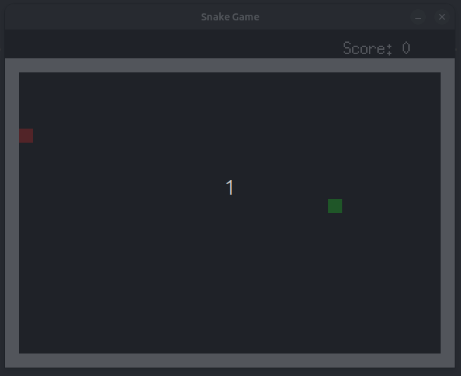

# Snake Game com Go e Ebiten

Este projeto implementa o clássico **Snake Game** usando a linguagem Go e a biblioteca **Ebiten** para jogos 2D. Ao longo deste tutorial, você aprenderá como criar um jogo básico, incluindo movimentação, colisões, pontuação e controle de reinício.



## Índice
1. [Pré-requisitos](#pré-requisitos)
2. [Instalação](#instalação)
3. [Estrutura do jogo](#estrutura-do-jogo)
4. [Desenvolvimento do jogo](#desenvolvimento-do-jogo)
   - [Configuração básica](#configuração-básica)
   - [Movimentação da Cobra](#movimentação-da-cobra)
   - [Colisão e limites](#colisão-e-limites)
   - [Placar e bordas](#placar-e-bordas)
   - [Reinício e saída do jogo](#reinício-e-saída-do-jogo)
5. [Rodando o jogo](#rodando-o-jogo)
6. [Customizações](#customizações)
7. [Conclusão](#conclusão)

---

## Pré-requisitos

Antes de começar, certifique-se de ter os seguintes itens instalados:

- **Go**: Instale a versão mais recente do Go a partir de [golang.org](https://golang.org/doc/install).
- **Ebiten**: A biblioteca de desenvolvimento de jogos 2D para Go. Vamos instalá-la no próximo passo.

## Instalação

1. Clone o repositório para sua máquina local:

   ```bash
   git clone https://github.com/seu-usuario/snake-game-go-ebiten.git
   cd snake-game-go-ebiten
   ```

2. Instale a biblioteca **Ebiten**:

   ```bash
   go get github.com/hajimehoshi/ebiten/v2
   ```

## Estrutura do jogo

O Snake Game é composto por uma cobra que se movimenta pela tela, come a comida para crescer e deve evitar colidir consigo mesma ou com as bordas. Aqui estão os principais componentes do jogo:

1. **Cobra**: Representada como uma lista de segmentos (`[]image.Point`).
2. **Comida**: Um ponto na tela que é gerado aleatoriamente.
3. **Pontuação**: A pontuação aumenta a cada vez que a cobra come a comida.
4. **Colisões**: O jogo verifica se a cobra colidiu com as bordas ou consigo mesma.
5. **Teclas de controle**: O jogador usa as setas do teclado para controlar a direção da cobra. As teclas `R` reiniciam o jogo e `Q` ou `ESC` saem do jogo.

## Desenvolvimento do jogo

### Configuração básica

O primeiro passo foi configurar o jogo usando a biblioteca Ebiten. Definimos a tela com largura e altura constantes e o tamanho da grade, que será o tamanho de cada segmento da cobra e da comida.

```go
const (
    screenWidth   = 320
    screenHeight  = 240
    gridSize      = 10
    snakeSpeed    = 5
    placarHeight  = 20
    borderPadding = 10
)
```

### Movimentação da Cobra

Cada segmento da cobra é representado por um ponto no plano (`image.Point`). A cobra se movimenta automaticamente em uma direção específica, que pode ser controlada pelo usuário.

```go
type Game struct {
    snake      []image.Point
    direction  image.Point
    ...
}

func (g *Game) Update() error {
    if ebiten.IsKeyPressed(ebiten.KeyArrowUp) && g.direction.Y == 0 {
        g.direction = image.Point{X: 0, Y: -gridSize}
    } else if ebiten.IsKeyPressed(ebiten.KeyArrowDown) && g.direction.Y == 0 {
        g.direction = image.Point{X: 0, Y: gridSize}
    }
    ...
}
```

### Colisão e limites

Para evitar que a cobra ultrapasse as bordas ou entre na área reservada para o placar, implementamos limites no campo de jogo. Quando a cobra colide com as bordas ou consigo mesma, o jogo termina.

```go
if newHead.X < borderPadding || newHead.X >= screenWidth-borderPadding ||
   newHead.Y < placarHeight+borderPadding || newHead.Y >= screenHeight-borderPadding {
    g.gameOver = true
    return nil
}
```

### Placar e bordas

Adicionamos um placar visível no canto superior direito e uma borda ao redor do campo de jogo. A área reservada para o placar é excluída da área de movimento da cobra.

```go
func (g *Game) Draw(screen *ebiten.Image) {
    scoreText := fmt.Sprintf("Score: %d", g.score)
    ebitenutil.DebugPrintAt(screen, scoreText, screenWidth-80, 5)

    // Desenhar as bordas
    borderColor := color.RGBA{255, 255, 255, 255}
    ebitenutil.DrawRect(screen, 0, placarHeight, screenWidth, borderPadding, borderColor)  // Topo
    ...
}
```

### Reinício e saída do jogo

Permitimos que o jogador reinicie o jogo pressionando `R`, ou saia pressionando `Q` ou `ESC`.

```go
if ebiten.IsKeyPressed(ebiten.KeyR) {
    g.init()
}

if ebiten.IsKeyPressed(ebiten.KeyQ) || ebiten.IsKeyPressed(ebiten.KeyEscape) {
    os.Exit(0)
}
```

## Rodando o jogo

Para rodar o jogo, use o seguinte comando:

```bash
go run main.go
```

Agora você pode controlar a cobra com as setas do teclado, reiniciar o jogo com `R` e sair com `Q` ou `ESC`.

## Customizações

Aqui estão algumas sugestões de melhorias que você pode adicionar ao jogo:

1. **Aumentar a dificuldade**: Aumente a velocidade da cobra conforme o jogador avança.
2. **Sons**: Adicione sons para quando a cobra comer a comida ou colidir.
3. **Modos de jogo**: Implemente modos como "crescimento rápido" ou "diminuição de área de jogo".

## Conclusão

Neste tutorial, implementamos um **Snake Game** simples utilizando Go e Ebiten, cobrindo desde a configuração inicial até a adição de elementos como bordas, placar e controle de reinício. Agora que você tem a base, pode expandir este projeto para criar uma versão personalizada do Snake Game!

---

### Licença

Este projeto é licenciado sob a [MIT License](LICENSE).
